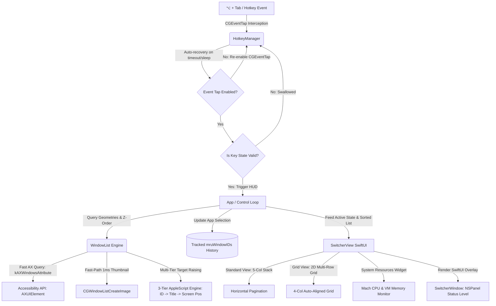

#  OptTab

<p align="left">
  <a href="https://apple.com"></a>
  <a href="https://swift.org"></a>
  <a href="LICENSE"></a>
  <a href="https://github.com/nikhilJa1n/OptTab-MAC/actions"></a>
  <a href="https://github.com/nikhilJa1n/OptTab-MAC/releases"></a>
</p>

**OptTab** is a next-generation window manager and interactive switcher HUD designed to replace the default macOS app switcher and dock experiences. Built natively in Swift and SwiftUI, it introduces a beautiful glassmorphic interface, dynamic multi-row layouts, multi-window tab grouping, and hardware-accelerated preview controls—all running as a zero-latency, lightweight background agent.

---

## 🚀 Architectural Blueprint

OptTab operates by tapping directly into the macOS window server event stream, using a decoupled event-driven architecture with automatic event tap recovery to keep CPU overhead minimal and performance instantaneous.



---

## 🌟 Key Features

### 1. Smart App Switcher (`⌥ + Tab`)
*   **Tracked MRU Sorting**: Replaces unstable OS Z-ordering. The default `"Recently Used"` list sorts strictly by your active window history (`mruWindowIDs`), ensuring the most recently active window is always selected first.
*   **Multi-Window & Tab Grouping**: Preserves separate real OS windows for multi-window apps (Terminal, Chrome, Finder) as individual switcher cards while automatically merging duplicate internal tabs.
*   **Multi-Tier Window Raising**: 3-tier AppleScript window matcher (**ID → Title → Screen Coordinates**) ensures targeting secondary windows of any app works 100% reliably even when window titles dynamically change.
*   **Grid Layout Mode**: Toggle between a horizontal single row and a dynamic 2D multi-row grid that dynamically adapts window thumbnail scaling.
*   **Aero Action Panel**: Instantly Close, Minimize, Maximize, or Force Quit applications directly from their switcher cards (`W` / `M` / `F` / `Q`).
*   **Dynamic Arrow Navigation**: Cycle highlights smoothly using Left/Right (`←`/`→`) or Up/Down (`↑`/`↓`) arrow keys.
*   **Resource Widgets**: Real-time glassmorphic CPU and RAM monitors embedded directly in the switcher HUD.

### 2. High-Performance Engine
*   **20x Faster Window Scanning**: Optimized AX scanning querying `kAXWindowsAttribute` directly (~5ms window scanning speed).
*   **1ms Fast-Path Card Thumbnails**: Instant snapshot rendering via `CGWindowListCreateImage` fast path with zero thread blocking.
*   **In-Memory Icon Caching**: Thread-safe app icon caching (`iconCache`) eliminates disk I/O during shortcut cycles.
*   **Hotkey Auto-Recovery**: Automatic Event Tap recovery on system load/timeout and system wake handlers ensure Option+Tab never freezes after sleep.

### 3. Personalization & Diagnostics
*   **Complete Version History View**: Interactive in-app changelog viewer with release notes and feature highlights for every version.
*   **Send Logs to Dev**: Submit diagnostic logs directly via native macOS Mail or Finder reveal in a single click.
*   **Interactive Dock Previews**: Hover over active Dock icons to inspect live window preview grids of background applications.

---

## ⌨️ Control & Shortcuts Guide

| Action | Shortcut / Gesture |
| :--- | :--- |
| **Open Switcher / Cycle Forward** | `⌥ + Tab` |
| **Cycle Backward** | `⌥ + ⇧ + Tab` (Option + Shift + Tab) |
| **Arrow Key Navigation** | `←` / `→` (Horizontal) or `↑` / `↓` (Vertical Grid) |
| **Select Highlighted Window** | Release `⌥` (or press `Space` / `Enter` if pinned) |
| **Cancel / Dismiss HUD** | Press `⎋ (Esc)` |
| **Close / Minimize / Maximize Card** | Press `W` (Close), `M` (Minimize), `F` (Full Screen / Maximize), `Q` (Quit) |

---

## ⚙️ Requirements & Security Model

*   **Operating System**: macOS 14.0 (Sonoma) or newer.
*   **Security & Privacy Policy**:
    *   OptTab operates **entirely locally**. No screen data, window titles, keystrokes, or process lists are ever transmitted, saved, or sent over a network.
    *   **Accessibility API**: Required to retrieve window titles and control windows (minimize, maximize, close, and snap).
    *   **Screen Recording Permission**: Required by `ScreenCaptureKit` and macOS Window Server to display switcher card thumbnails.

---

## 🛠️ Build & Installation

### Prerequisites
*   Xcode 15.0 or newer (Swift 5.9+ compiler tools).

### Building from Source

To compile and package OptTab:

1.  Clone the repository:
    ```bash
    git clone https://github.com/nikhilJa1n/OptTab-MAC.git
    cd OptTab-MAC
    ```

2.  Run the build script:
    ```bash
    chmod +x build.sh
    ./build.sh
    ```

This generates **`OptTab.dmg`**. Drag-and-drop the app bundle inside it to your `/Applications` directory.

---

## 🚀 Publishing Releases

OptTab features an **automated release and version history pipeline**:

```bash
# Usage: ./publish_release.sh <marketing_version> <build_number> [release_notes]
./publish_release.sh 2.7 27 "• Multi-window tab grouping\n• 20x faster window scanning\n• Hotkey auto-recovery"
```

### Automation Workflow:
1. **Automated Version History Update**: Running `publish_release.sh` automatically updates `Sources/VersionHistory.swift` and `update.json` with the new version notes.
2. **Build & Package**: Compiles `OptTab.app` and creates `OptTab.dmg` and `OptTab.zip`.
3. **Git Tagging**: Automatically commits config changes and tags the commit locally as `v$VERSION`.

---

## 🛡️ License & Contributing

Licensed under the [MIT License](LICENSE). Contributions, bug reports, and feature pull requests are always welcome!
