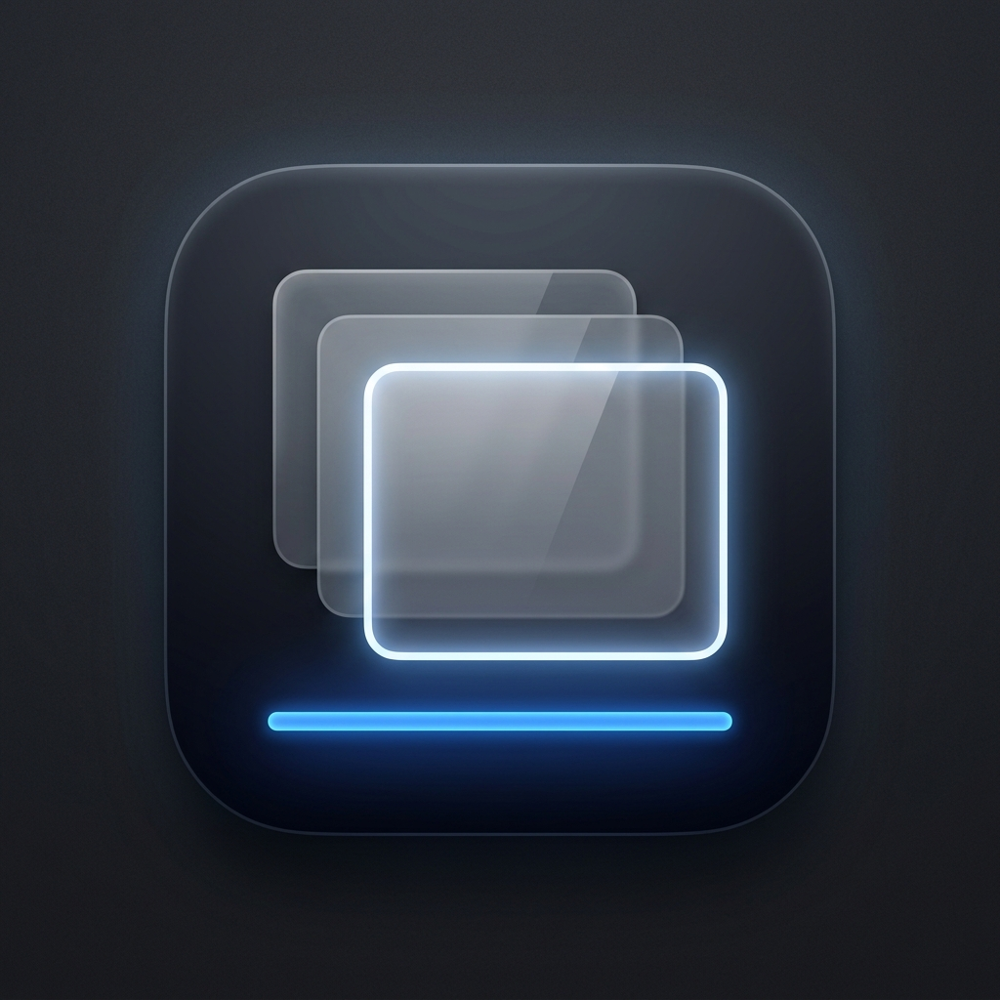
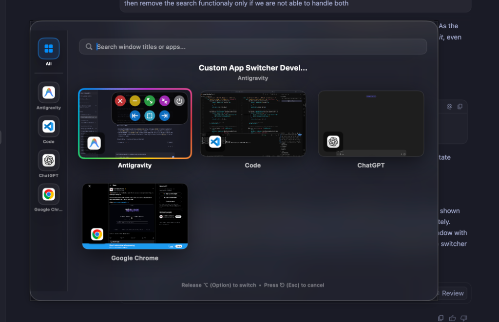
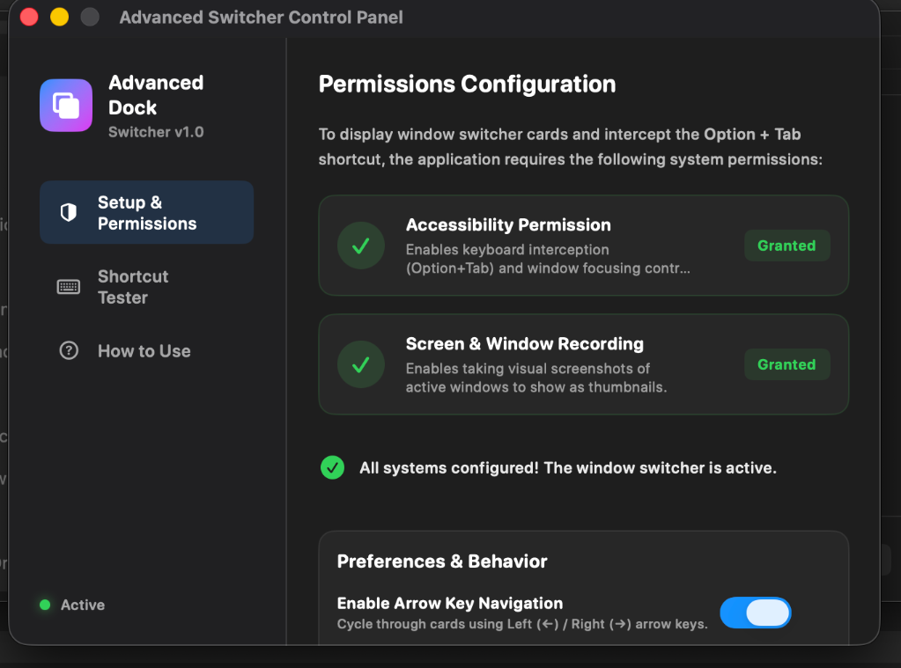
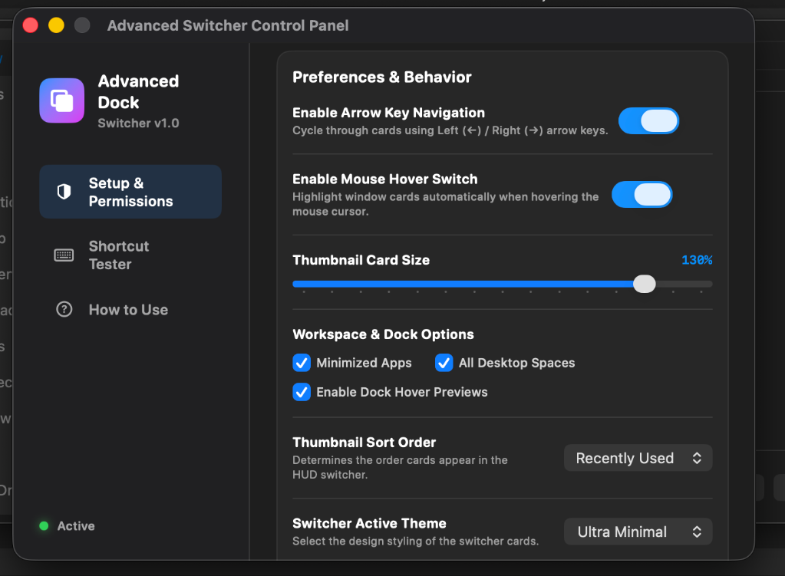
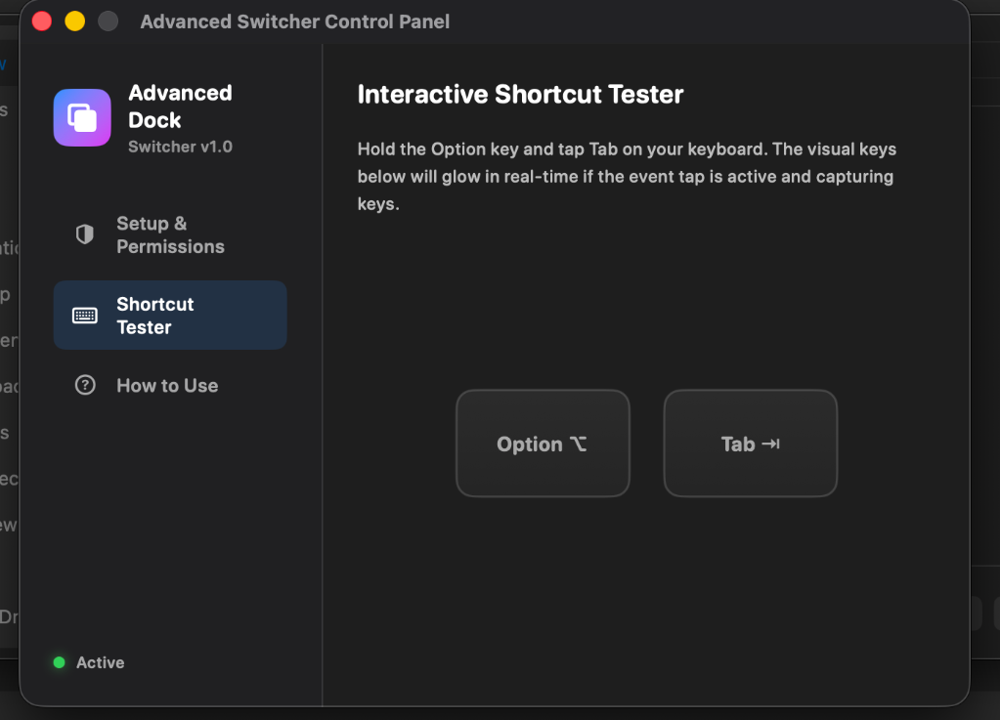
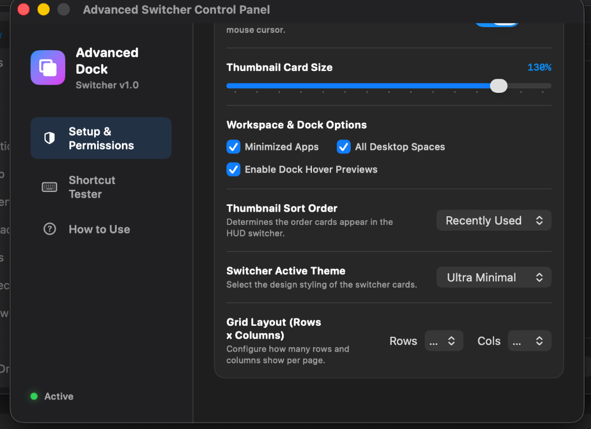
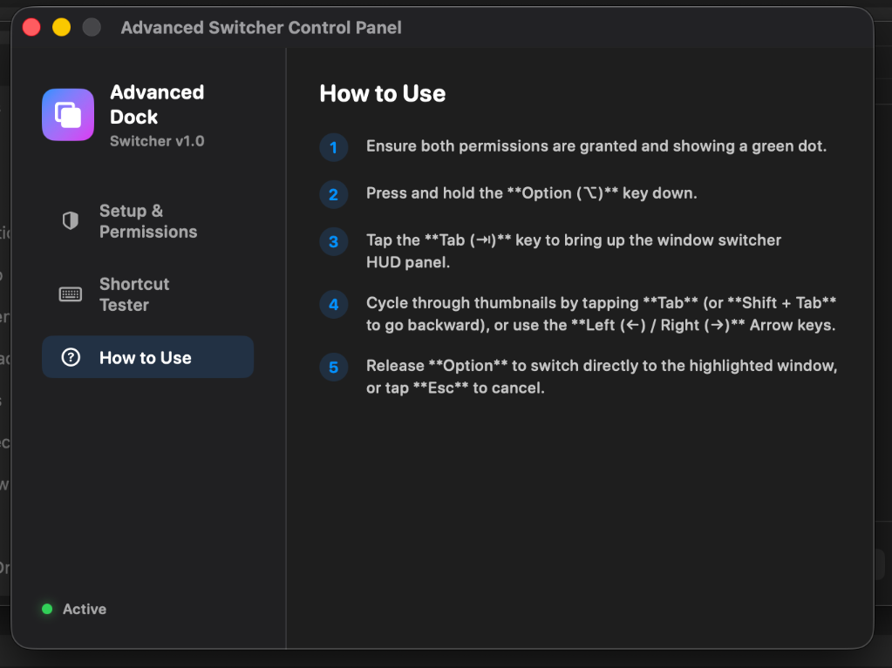

#  AdvancedDock

[](https://apple.com)
[](https://swift.org)
[](LICENSE)
[](.github/workflows/build.yml)

**AdvancedDock** is a premium, open-source macOS utility that redefines window switching and dock interactions. It replaces the default macOS app switcher and dock behaviors with a modern, glassmorphic HUD panel featuring fuzzy search, app-based sidebar grouping, and interactive dock hover window previews.

Built natively in Swift and SwiftUI, AdvancedDock runs as a highly efficient background agent that overlays seamlessly across all workspaces and full-screen spaces.

> [!NOTE]
> AdvancedDock operates as a background element (`LSUIElement = true`), meaning it stays out of your active Dock space, stays lightweight, and doesn't steal focus while you are working.

---

## 🌟 Key Features

### 1. Smart App Switcher (`⌥ + Tab`)
*   **Quick Switch**: Hold `⌥ (Option)` and tap `Tab` to cycle between windows. Release `⌥` to switch immediately.
*   **Search Pinning**: Click the search bar or type search queries to lock the switcher open, allowing you to search and select windows without holding keys.
*   **Fuzzy Search**: Instantly filter open windows by title or application name.
*   **Sidebar Grouping**: Clean sidebar categorizing open windows by app for organized navigation.
*   **Window Cards & Thumbnails**: Real-time window preview cards featuring app-badge icons. Drag a card upwards to close the window instantly.
*   **Aero Action Panel**: Quick window controls directly from the card (Close, Minimize, Maximize, Exit Full-Screen, Force Quit).
*   **Window Snapping**: Snap windows to the left half, right half, or maximize them instantly with one click.
*   **Customizable Grid**: Configure the switcher's grid layout (rows and columns) to fit your screen size and workspace preferences.
*   **Customizable Layouts**: Toggle between **Standard** layout (sidebar, search bar, full grid) and **Minimalist** layout (clean horizontal row, hidden sidebar, and a search bar that appears dynamically only when typing starts).

### 2. Interactive Dock Previews
*   Hover over any active Dock icon to see real-time floating thumbnails of that application's open windows.
*   Select, close, or snap windows directly from the dock hover preview panel.
*   **Customizable Sizing**: Adjust the dock hover preview thumbnail size independently from 70% to 200% using a dedicated slider in the Control Panel settings.

### 3. Dynamic Themes
*   **Glassmorphism**: Elegant frosted translucent borders (Default).
*   **Ultra Minimal**: Clean, borderless, content-first flat theme.
*   **Neon Blue**: Vibrant, cyberpunk-style glowing active borders and shadows.
*   **Rainbow Sweep**: Beautiful animated spectrum gradients cycling around selected window cards.

---

## 📸 Preview & Aesthetics

The interface is built with native macOS visual effects (frosted glass) and premium transitions to ensure it looks and feels like a native part of macOS:

### 1. App Switcher HUD



### 2. Control Panel & Preferences

AdvancedDock includes a comprehensive Control Panel to configure hotkeys, themes, and monitor accessibility permissions:

| Permissions Setup | General Preferences |
| :---: | :---: |
|  |  |

| Shortcut Tester | Theme & Grid Options |
| :---: | :---: |
|  |  |

| How to Use Guide |
| :---: |
|  |

---

## ⌨️ Control & Shortcuts Guide

| Action | Shortcut / Gesture |
| :--- | :--- |
| **Open Switcher / Cycle Forward** | `⌥ + Tab` |
| **Cycle Backward** | `⌥ + ⇧ + Tab` (Option + Shift + Tab) |
| **Arrow Key Navigation** | `←` / `→` or `↑` / `↓` |
| **Select Highlighted Window** | Release `⌥` (or press `Space` / `Enter` if pinned) |
| **Cancel & Dismiss** | Press `⎋ (Esc)` |
| **Pin Switcher Open** | Click the Search Bar or start typing |
| **Close Window (Gesture)** | Drag the window card upwards and release |
| **Trigger Snapping** | Hover over card, click a layout button in the action panel |

---

## ⚙️ System Requirements & Permissions

*   **Operating System**: macOS 14.0 (Sonoma) or newer.
*   **Permissions Required**:

> [!WARNING]
> Due to macOS sandbox restrictions, the following permissions must be explicitly granted on the first launch for the app to function:

1.  **Accessibility**: Required to retrieve window titles, control windows (minimize, close, maximize), and perform window snapping.
2.  **Screen Recording (Screen Capture)**: Required to capture real-time window thumbnails and previews. *(No screen data is saved, uploaded, or transmitted; previews are generated strictly locally in-memory).*

---

## 🏗️ Technical Architecture & Under-the-Hood

AdvancedDock is engineered for speed, low energy impact, and seamless macOS integration:
- **`HotkeyManager`**: Uses a low-level Cocoa `CGEventTap` to intercept `⌥ + Tab` keystrokes globally without blocking the system's event dispatch queue.
- **`WindowList`**: Queries window states using the macOS Accessibility API (`AXUIElement`) and bridges them with the CoreGraphics Window List (`CGWindowListCopyWindowInfo`).
- **`ScreenCaptureKit` / `CGWindowListCreateImage`**: Captures fast, hardware-accelerated window thumbnails on demand, caching them efficiently to prevent high RAM/CPU usage.
- **`SwitcherWindow`**: A custom `NSPanel` subclass configured as a `.nonactivatingPanel` with a status bar level to overlay over active spaces and full-screen spaces.

---

## 🛠️ Build & Installation

### Prerequisites
*   Xcode 15.0 or newer (specifically `swift` compiler tools version 5.9+).
*   A self-signed or developer certificate named `AdvancedDockDeveloper` to code-sign the app (required for Screen Capture API permissions).

### Building from Source

To compile, package, and install AdvancedDock into your Applications folder:

1.  Clone the repository:
    ```bash
    git clone https://github.com/yourusername/AdvancedDock.git
    cd AdvancedDock
    ```

2.  Run the build, signing, and packaging script:
    ```bash
    chmod +x build.sh
    ./build.sh
    ```

This compiles the release binary, signs it, and packages it into a ready-to-distribute compressed disk image: **`AdvancedDock.dmg`**.

3.  Double-click **`AdvancedDock.dmg`** and drag-and-drop the application into your **Applications** folder to install it.

---

## 🛡️ License

This project is licensed under the **MIT License** - see the [LICENSE](LICENSE) file for details.

---

## 🤝 Contributing

Contributions are welcome! Please feel free to open Issues or submit Pull Requests to help improve AdvancedDock.
